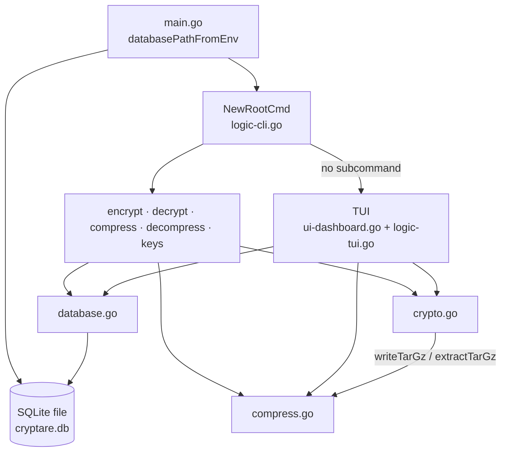
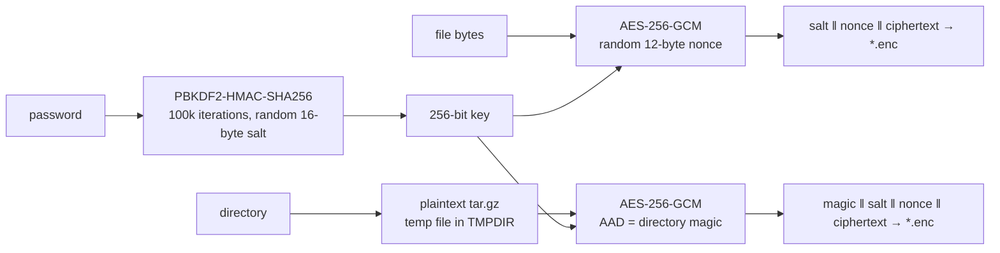
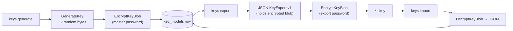

# Repository Map

Last updated: 2026-09-23. Architecture rules live in [`maint.md`](maint.md).

## Structure

```text
Cryptare/
├── main.go                  # entry: open DB, build Cobra root command, execute
├── database_path.go         # CRYPTARE_DB_PATH lookup (default ./cryptare.db)
├── database_path_test.go
├── version_test.go          # --version flag test
├── internal/                # single Go package `internal`
│   ├── crypto.go            # KDF, AES-GCM file/dir encryption, key blobs, key export/import
│   ├── compress.go          # gzip / tar.gz / zip create + extract; closeWithError helper
│   ├── database.go          # GORM + SQLite, KeyModel, key CRUD
│   ├── logic-cli.go         # Cobra commands, password/confirm prompts, output-name helpers
│   ├── ui-dashboard.go      # Bubble Tea model types, messages, constructors, Init
│   ├── logic-tui.go         # Bubble Tea Update/View, forms, vim mode, action commands
│   └── *_test.go            # unit, CLI and TUI tests
├── .github/workflows/       # ci.yml, cd.yml, docker.yml, security.yml
├── .devcontainer/           # Ubuntu + Go + Neovim dev container
├── Dockerfile               # CGO build (golang:1.26-alpine) → alpine:3.22 runtime
├── Makefile                 # release tagging only: tag, push-tag, release
├── intel/                   # engineering docs (this directory)
├── AGENTS.md, README.md, CONTRIBUTING.md, CODE_OF_CONDUCT.md
├── LICENSE (Apache-2.0), NOTICE, CODEOWNERS (@jabbott-iii)
└── .idea/ (tracked), .junie/ (untracked, empty)   # IDE / agent workspace files
```

## Components

| Component | Key symbols | Notes |
|---|---|---|
| Entry | `main`, `newRootCmd`, `version`, `databasePathFromEnv` | Opens the DB before any command runs, even `--help` and `--version`. `version` defaults to `dev`; release builds set it with `-X main.version=<tag>`. |
| CLI | `NewRootCmd`, `new*Cmd`, `readPassword`, `confirmAction`, `derive*Output` | `--vim` is a root flag; `--password/-p` on crypto and key commands. |
| TUI | `DashboardModel`, `fieldsFor`, `updateForm`, `handleVimFormKey`, `buildActionCmd` | Forms mirror the CLI operations; actions run as `tea.Cmd`s. |
| Crypto | `EncryptFile`, `DecryptFile`, `encryptBytesWithAAD`, `encryptDirectory`, `GenerateKey`, `EncryptKeyBlob`, `DecryptKeyBlob`, `ExportKeyToFile`, `ImportKeyFromFile` | Whole-file, in-memory encryption. Directory mode reuses `writeTarGz` and `extractTarGz`. |
| Compression | `CompressFileWithFormat`, `DecompressFile`, `writeTarGz`, `writeZip`, `extractTarGz`, `extractZip` | Rejects symlinks, special files and `..` traversal. |
| Storage | `NewDatabase`, `KeyModel`, `SaveKey`, `ListKeys`, `GetKey`, `DeleteKey` | `DeleteKey` uses raw SQL `DELETE … RETURNING` (a hard delete). |

## Dependencies

| Module | Version | Used for |
|---|---|---|
| `github.com/spf13/cobra` | v1.10.2 | CLI |
| `github.com/charmbracelet/bubbletea` / `lipgloss` | v1.3.10 / v1.1.0 | TUI |
| `github.com/charmbracelet/x/term` | v0.2.2 | Hidden password input at the CLI prompt |
| `gorm.io/gorm` + `gorm.io/driver/sqlite` | v1.31.2 / v1.6.0 | Storage, via `github.com/mattn/go-sqlite3` v1.14.52 (**CGO**) |
| `golang.org/x/crypto` | v0.56.0 | `pbkdf2` only |

## Component dependencies



## Encryption data flow



Decryption reverses the flow. `DecryptFile` checks for the directory magic prefix
first and restores the tree with `extractTarGz`; otherwise it writes one plaintext file.

## Key management flow



Stored keys are not used by any encrypt or decrypt path today (Q-002 in `notes.md`).

## CI/CD

All third-party actions are pinned to full commit SHAs.

| Workflow | Trigger | What it does |
|---|---|---|
| `ci.yml` | push/PR (all branches) | Ubuntu, Windows and macOS matrix: `go mod tidy` diff, `go vet`, golangci-lint v2.13.2, `go test` with coverage (Codecov). Then a native CGO build, smoke-tested with `--version`, `keys generate`/`keys list` and an encrypt/decrypt round-trip. |
| `security.yml` | push/PR, weekly | CodeQL (Go, security-extended). gosec v2.29.0, with SARIF uploaded to Code Scanning (category `gosec`). |
| `docker.yml` | push/PR to `main` | `docker build`, `--help`, then `keys generate`/`keys list` on a named volume |
| `cd.yml` | `v*` tags, manual | Native CGO build per target on a matching runner: linux amd64/arm64 (static), darwin arm64, darwin amd64 (cross-compiled), windows amd64. Stamps `-X main.version=<tag>`, smoke-tests every target except darwin/amd64, packages `cryptare_<os>_<arch>` archives plus `checksums.txt`, and creates a GitHub Release on tags. |
