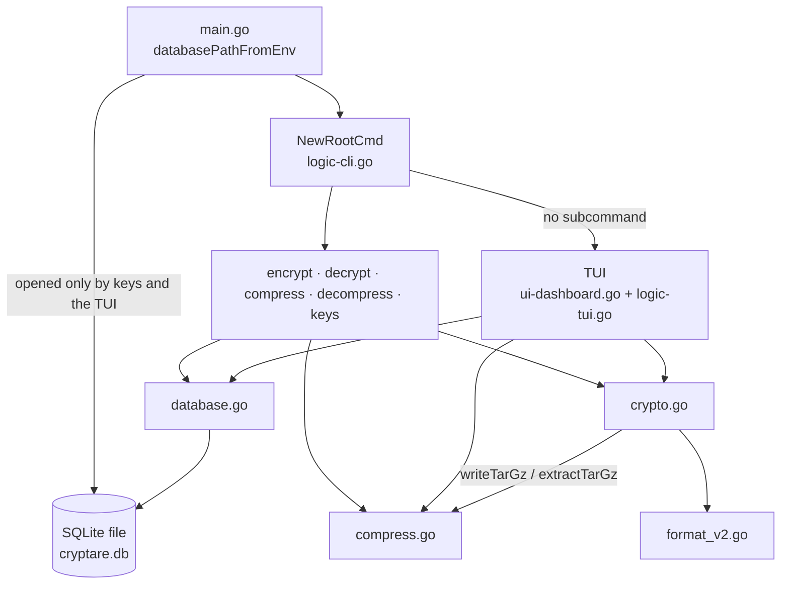
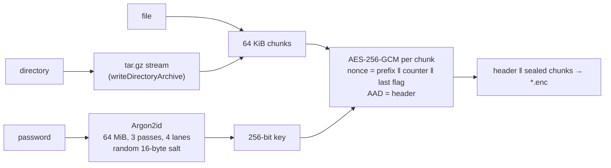
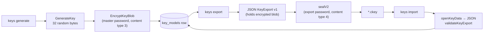

# Repository Map

Last updated: 2026-10-03 (Tier A). Architecture rules live in [`maint.md`](maint.md).

## Structure

```text
Cryptare/
├── main.go                  # entry: build Cobra root command with a lazy DB opener, execute
├── database_path.go         # CRYPTARE_DB_PATH lookup (default ./cryptare.db)
├── database_path_test.go
├── version_test.go          # --version flag test
├── lazy_database_test.go    # only keys commands open (and create) the DB
├── interrupt_test.go        # exit codes; TestRunMain helper for subprocess tests
├── interrupt_unix_test.go   # SIGINT during a decrypt: exit 130, nothing left behind
├── internal/                # single Go package `internal`
│   ├── crypto.go            # file/dir encryption, legacy (v1) reads, key blobs, key export/import
│   ├── format_v2.go         # version 2 format: header, Argon2id, chunked AES-GCM stream
│   ├── compress.go          # gzip / tar.gz / zip create + extract; closeWithError helper
│   ├── database.go          # GORM + SQLite, KeyModel, key CRUD, database file trust check
│   ├── fileowner_unix.go    # fileOwner: a file's owner on Unix (build-tagged)
│   ├── fileowner_other.go   # fileOwner stub for other platforms
│   ├── logic-cli.go         # Cobra commands, password/confirm prompts, output-name helpers
│   ├── ui-dashboard.go      # Bubble Tea model types, messages, constructors, Init
│   ├── logic-tui.go         # Bubble Tea Update/View, forms, vim mode, action commands
│   └── *_test.go            # unit, CLI and TUI tests; legacy_fixtures_test.go writes v1 layouts; cancel_test.go stops operations partway
├── .github/workflows/       # ci.yml, cd.yml, docker.yml, security.yml
├── .github/dependabot.yml   # weekly gomod and github-actions update PRs
├── .devcontainer/           # Ubuntu + Go + Neovim dev container
├── Dockerfile               # CGO build (golang:1.26.8-alpine) → alpine:3.22 runtime
├── Makefile                 # release tagging only: tag, push-tag, release
├── intel/                   # engineering docs (this directory)
├── AGENTS.md, README.md, CONTRIBUTING.md, CODE_OF_CONDUCT.md
├── LICENSE (Apache-2.0), NOTICE, CODEOWNERS (@jabbott-iii)
└── .idea/ (tracked), .junie/ (untracked, empty)   # IDE / agent workspace files
```

## Components

| Component | Key symbols | Notes |
|---|---|---|
| Entry | `main`, `newRootCmd`, `databaseOpener`, `version`, `databasePathFromEnv` | Passes a lazy opener; the DB is opened only by the `keys` commands and the TUI. `version` defaults to `dev`; release builds set it with `-X main.version=<tag>`. |
| CLI | `NewRootCmd`, `NewRootCmdLazy`, `DatabaseOpener`, `openOnce`, `new*Cmd`, `readPassword`, `readNewPassword`, `confirmAction`, `derive*Output`, `displayText`, `runCancellable`, `InterruptedError`, `checkExportOutput` | `--vim` is a root flag; `--password/-p` (prints a warning) and `--password-file` (`passwordFlags`) on crypto and key commands. `--force` on `encrypt`, `decrypt`, `compress` and `decompress` allows overwriting an existing output. `--max-size` and `--max-entries` on `decompress` and `decrypt` set the extraction limits. File commands run under `runCancellable`: a signal cancels the operation, which removes its unfinished output, and the exit status is 128 + the signal (SEC-015). `keys export` takes `--force` and never writes over the key database (BUG-017). |
| TUI | `DashboardModel`, `fieldsFor`, `updateForm`, `handleVimFormKey`, `buildActionCmd`, `checkTUINewPassword`, `actionRunner`, `quit` | Forms mirror the CLI operations; actions run as `tea.Cmd`s. Forms that set a password have a "Confirm password" field. The key table shows stored values through `displayText`. Actions run through `actionRunner`; quitting while one runs cancels it and quits once it reports back (SEC-015). |
| Crypto | `EncryptFile`, `DecryptFile`, `DecryptFileWithLimits`, `encryptSingleFile`, `encryptDirectory`, `writeDirectoryArchive`, `restoreDirectoryArchive`, `decryptBytesWithAAD` (legacy), `GenerateKey`, `EncryptKeyBlob`, `DecryptKeyBlob`, `openKeyData`, `ExportKeyToFile`, `ImportKeyFromFile`, `validateKeyExport`, `validStoredKeyBlob`, `CheckPasswordPolicy`, `EncryptFileContext`, `DecryptFileWithLimitsContext`, `defaultEncryptOutput`, `checkOutputOutsideFolder` | Writes only the version 2 format and streams files and folders; legacy (version 1) data is still read, whole. Directory mode reuses `writeTarGz` and `extractTarGz`. `CheckPasswordPolicy` guards every path that sets a new password (`maint.md` §4). A folder's default output sits next to it, and an output inside it is refused (BUG-016). |
| Format v2 | `v2Header`, `newV2Header`, `parseV2Header`, `argon2Params`, `passwordKDF`, `encryptingWriter`, `decryptingReader`, `sealV2`, `openV2`, `errDecrypt`, `errUnsupportedFormat` | 46-byte header, Argon2id key, 64 KiB AES-256-GCM chunks (STREAM). `parseV2Header` refuses unknown values and Argon2id settings above its limits before deriving a key. Layout in `maint.md` §3. |
| Compression | `CompressFileWithFormat`, `DecompressFile`, `DecompressFileWithLimits`, `ExtractLimits`, `writeTarGz`, `writeZip`, `extractTarGz`, `extractZip`, `extractToDir`, `walkSourceTree`, `CheckOutputPath`, `writeFileAtomic`, `CompressFileWithFormatContext`, `DecompressFileWithLimitsContext`, `copyContext`, `gzipHeaderName` | Rejects symlinks, special files and `..` traversal. Folders are read through an `os.Root` (`walkSourceTree`). `CheckOutputPath` enforces the output-safety rules (`maint.md` §4). Extraction runs under `ExtractLimits` into a temporary folder (`extractToDir`), writes through an `os.Root`, and sets owner-only permissions (`extractDirMode`, `extractFileMode`). The `…Context` variants check for cancellation between reads and entries. Gzip header names are Latin-1 only (`gzipHeaderName`, BUG-015). |
| Storage | `NewDatabase`, `prepareDatabaseFile`, `checkDatabaseFileTrust`, `fileOwner`, `ErrUntrustedDatabase`, `withSecureDelete`, `KeyModel`, `SaveKey`, `ListKeys`, `GetKey`, `DeleteKey` | `DeleteKey` uses raw SQL `DELETE … RETURNING` (a hard delete). Connections open with SQLite `secure_delete` on, so deleted rows are overwritten. The file is created 0600, and an existing one is tightened to 0600. On Unix, a database or side file another user owns or others can write is refused (SEC-016). |

## Dependencies

| Module | Version | Used for |
|---|---|---|
| `github.com/spf13/cobra` | v1.10.2 | CLI |
| `github.com/charmbracelet/bubbletea` / `lipgloss` | v1.3.10 / v1.1.0 | TUI |
| `github.com/charmbracelet/x/term` | v0.2.2 | Hidden password input at the CLI prompt |
| `gorm.io/gorm` + `gorm.io/driver/sqlite` | v1.31.2 / v1.6.0 | Storage, via `github.com/mattn/go-sqlite3` v1.14.52 (**CGO**) |
| `golang.org/x/crypto` | v0.56.0 | `argon2` only (the legacy PBKDF2 key uses the standard library's `crypto/pbkdf2`) |

## Component dependencies


```mermaid
flowchart TD
  main["main.go<br/>databasePathFromEnv"] -->|"opened only by keys and the TUI"| dbfile[("SQLite file<br/>cryptare.db")]
  main --> root["NewRootCmd<br/>logic-cli.go"]
  root -->|no subcommand| tui["TUI<br/>ui-dashboard.go + logic-tui.go"]
  root --> cli["encrypt · decrypt · compress · decompress · keys"]
  cli --> crypto["crypto.go"]
  cli --> compress["compress.go"]
  cli --> database["database.go"]
  tui --> crypto
  tui --> compress
  tui --> database
  crypto -->|"writeTarGz / extractTarGz"| compress
  crypto --> format["format_v2.go"]
  database --> dbfile
```

## Encryption data flow

New data (version 2):


```mermaid
flowchart LR
  pw["password"] --> kdf["Argon2id<br/>64 MiB, 3 passes, 4 lanes<br/>random 16-byte salt"] --> key["256-bit key"]
  file["file"] --> chunks
  dir["directory"] --> tgz["tar.gz stream<br/>(writeDirectoryArchive)"] --> chunks
  chunks["64 KiB chunks"] --> gcm["AES-256-GCM per chunk<br/>nonce = prefix ‖ counter ‖ last flag<br/>AAD = header"]
  key --> gcm --> out["header ‖ sealed chunks → *.enc"]
```

Legacy data (version 1) is still read: `salt ‖ nonce ‖ ciphertext` for files, and the
same after the `CRYPTARE-DIR-ENC\x00` magic (used as AAD) for folders, with a PBKDF2-
HMAC-SHA256 key (100,000 iterations). Stored keys and key exports use the same two
formats with their own content types (`maint.md` §3).

Decryption reverses the flow. `DecryptFileWithLimits` peeks at the first bytes:
- version 2: it reads the header, checks its limits and content type, then decrypts
  chunk by chunk. A folder's tar.gz is restored with `extractTarGz` in a temporary
  folder, and a file goes to a temporary file. Either is kept only after the final
  chunk authenticates.
- legacy: it reads the whole file. The directory magic means a folder; anything else
  is one plaintext file.

## Key management flow


```mermaid
flowchart LR
  gen["keys generate"] --> rk["GenerateKey<br/>32 random bytes"] --> eb["EncryptKeyBlob<br/>(master password, content type 3)"] --> row[("key_models row")]
  row --> exp["keys export"] --> env["JSON KeyExport v1<br/>(holds encrypted blob)"] --> eb2["sealV2<br/>(export password, content type 4)"] --> ckey["*.ckey"]
  ckey --> imp["keys import"] --> dec["openKeyData → JSON<br/>validateKeyExport"] --> row
```

Stored keys are not used by any encrypt or decrypt path today (Q-002 in `notes.md`).

## CI/CD

All third-party actions are pinned to full commit SHAs.

| Workflow | Trigger | What it does |
|---|---|---|
| `ci.yml` | push/PR (all branches) | Ubuntu, Windows and macOS matrix: `go mod tidy` diff, `go vet`, golangci-lint v2.13.2, `go test` with coverage (Codecov). Then a native CGO build, smoke-tested with `--version`, `keys generate`/`keys list` and an encrypt/decrypt round-trip. |
| `security.yml` | push/PR, weekly | CodeQL (Go, security-extended). gosec v2.29.0, with SARIF uploaded to Code Scanning (category `gosec`). govulncheck v1.8.0 on the `go.mod` toolchain, failing on reachable vulnerabilities (SEC-018). |
| `docker.yml` | push/PR to `main` | `docker build`, `--help`, then `keys generate`/`keys list` on a named volume |
| `cd.yml` | `v*` tags, manual | Native CGO build per target on a matching runner: linux amd64/arm64 (static), darwin arm64, darwin amd64 (cross-compiled), windows amd64. Stamps `-X main.version=<tag>`, smoke-tests every target except darwin/amd64, packages `cryptare_<os>_<arch>` archives plus `checksums.txt`, and creates a GitHub Release on tags. |
